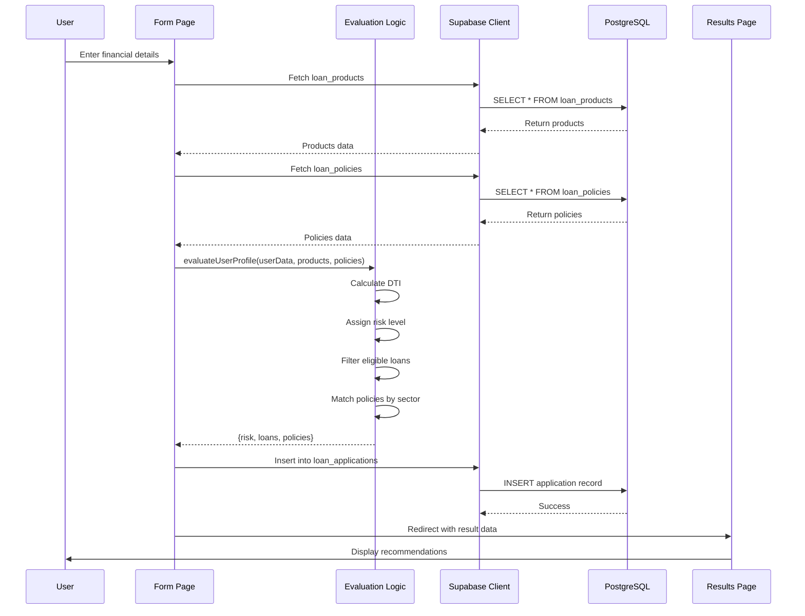
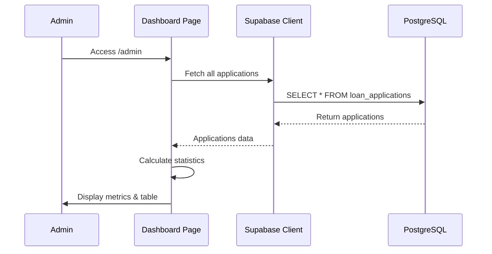

# Design Document: AI-Powered Loan & Policy Recommendation System

## Overview

A hackathon-ready web application that evaluates user financial profiles and recommends eligible loan products and sector-specific policies. Built with Next.js 14 (App Router), Tailwind CSS, and Supabase, the system calculates risk levels, matches users with appropriate financial products, and provides personalized AI-style explanations. All business logic resides in the /lib folder with no separate backend server, making it simple to deploy and maintain.

## Architecture

```mermaid
graph TD
    A[User Browser] --> B[Next.js App Router]
    B --> C[Form Page /]
    B --> D[Results Page /results]
    B --> E[Admin Dashboard /admin]
    
    C --> F[/lib/evaluation.ts]
    D --> F
    E --> G[/lib/supabase.ts]
    
    F --> G
    F --> H[/lib/explanation.ts]
    
    G --> I[(Supabase PostgreSQL)]
    
    I --> J[loan_products]
    I --> K[loan_policies]
    I --> L[loan_applications]
```

## Sequence Diagrams

### Main User Flow



### Admin Dashboard Flow



## Components and Interfaces

### Component 1: Supabase Client

**Purpose**: Provides server-side Supabase client for database operations

**Interface**:
```typescript
// /lib/supabase.ts
import { createClient } from '@supabase/supabase-js'

export interface Database {
  public: {
    Tables: {
      loan_products: LoanProduct
      loan_policies: LoanPolicy
      loan_applications: LoanApplication
    }
  }
}

export function getSupabaseClient(): SupabaseClient<Database>
```

**Responsibilities**:
- Initialize Supabase client with environment variables
- Provide typed database access
- Handle connection management

### Component 2: Evaluation Engine

**Purpose**: Core business logic for loan and policy recommendation

**Interface**:
```typescript
// /lib/evaluation.ts
export interface UserData {
  user_name: string
  age: number
  income: number
  credit_score: number
  employment_type: string
  sector: string
  existing_emi: number
  requested_amount: number
}

export interface EvaluationResult {
  risk_level: 'Low' | 'Medium' | 'High'
  recommended_loans: EligibleLoan[]
  recommended_policies: RelevantPolicy[]
}

export interface EligibleLoan {
  loan_name: string
  interest_rate: number
  max_amount: number
  tenure_months: number
  suitability_score: number
}

export interface RelevantPolicy {
  policy_name: string
  sector: string
  benefits: string
  relevance_score: number
}

export function evaluateUserProfile(
  userData: UserData,
  loanProducts: LoanProduct[],
  policies: LoanPolicy[]
): EvaluationResult
```

**Responsibilities**:
- Calculate Debt-to-Income (DTI) ratio
- Assign risk level based on credit score
- Filter eligible loan products
- Match sector-specific policies
- Calculate suitability and relevance scores

### Component 3: Explanation Generator

**Purpose**: Generate personalized AI-style explanations

**Interface**:
```typescript
// /lib/explanation.ts
export interface ExplanationInput {
  userData: UserData
  result: EvaluationResult
}

export function generateExplanation(input: ExplanationInput): string
```

**Responsibilities**:
- Create dynamic personalized messages
- Format financial data in readable format
- Provide modular structure for future OpenAI API integration

### Component 4: Form Page

**Purpose**: Collect user financial information

**Interface**:
```typescript
// /app/page.tsx
export default function HomePage(): JSX.Element
```

**Responsibilities**:
- Render input form with validation
- Handle form submission
- Fetch loan products and policies from Supabase
- Call evaluation logic
- Store application in database
- Redirect to results page

### Component 5: Results Page

**Purpose**: Display recommendations and explanations

**Interface**:
```typescript
// /app/results/page.tsx
export default function ResultsPage(): JSX.Element
```

**Responsibilities**:
- Display risk level badge
- Show eligible loans in card layout
- List recommended policies
- Render AI-style explanation

### Component 6: Admin Dashboard

**Purpose**: Monitor applications and statistics

**Interface**:
```typescript
// /app/admin/page.tsx
export default function AdminPage(): JSX.Element
```

**Responsibilities**:
- Display total applications count
- Show high risk applications count
- Calculate average credit score
- Render applications table

## Data Models

### Model 1: LoanProduct

```typescript
export interface LoanProduct {
  id: string
  loan_name: string
  min_income: number
  min_credit_score: number
  max_amount: number
  max_dti_ratio: number
  interest_rate: number
  tenure_months: number
}
```

**Validation Rules**:
- min_income must be positive
- min_credit_score must be between 300 and 900
- max_amount must be positive
- max_dti_ratio must be between 0 and 1
- interest_rate must be positive
- tenure_months must be positive

### Model 2: LoanPolicy

```typescript
export interface LoanPolicy {
  id: string
  policy_name: string
  sector: string
  min_income: number
  min_credit_score: number
  max_amount: number
  description: string
  benefits: string
}
```

**Validation Rules**:
- sector must be one of: Education, MSME, Agriculture, Women, Startup, Housing
- min_income must be positive
- min_credit_score must be between 300 and 900
- max_amount must be positive

### Model 3: LoanApplication

```typescript
export interface LoanApplication {
  id: string
  user_name: string
  age: number
  income: number
  credit_score: number
  employment_type: string
  sector: string
  existing_emi: number
  requested_amount: number
  risk_level: string
  recommended_loans: EligibleLoan[]
  recommended_policies: RelevantPolicy[]
  created_at: string
}
```

**Validation Rules**:
- age must be between 18 and 100
- income must be positive
- credit_score must be between 300 and 900
- existing_emi must be non-negative
- requested_amount must be positive
- risk_level must be one of: Low, Medium, High

## Algorithmic Pseudocode

### Main Evaluation Algorithm

```typescript
function evaluateUserProfile(
  userData: UserData,
  loanProducts: LoanProduct[],
  policies: LoanPolicy[]
): EvaluationResult {
  // Step 1: Calculate DTI ratio
  const dti = userData.existing_emi / userData.income
  
  // Step 2: Assign risk level
  let riskLevel: 'Low' | 'Medium' | 'High'
  if (userData.credit_score < 600) {
    riskLevel = 'High'
  } else if (userData.credit_score >= 600 && userData.credit_score <= 700) {
    riskLevel = 'Medium'
  } else {
    riskLevel = 'Low'
  }
  
  // Step 3: Filter eligible loans
  const eligibleLoans: EligibleLoan[] = []
  
  for (const product of loanProducts) {
    const isEligible = 
      userData.income >= product.min_income &&
      userData.credit_score >= product.min_credit_score &&
      dti <= product.max_dti_ratio
    
    if (isEligible) {
      const suitabilityScore = calculateSuitabilityScore(
        userData,
        product,
        dti
      )
      
      eligibleLoans.push({
        loan_name: product.loan_name,
        interest_rate: product.interest_rate,
        max_amount: product.max_amount,
        tenure_months: product.tenure_months,
        suitability_score: suitabilityScore
      })
    }
  }
  
  // Sort by suitability score and take top 3
  eligibleLoans.sort((a, b) => b.suitability_score - a.suitability_score)
  const topLoans = eligibleLoans.slice(0, 3)
  
  // Step 4: Match policies by sector
  const relevantPolicies: RelevantPolicy[] = []
  
  for (const policy of policies) {
    const isRelevant =
      policy.sector === userData.sector &&
      userData.income >= policy.min_income &&
      userData.credit_score >= policy.min_credit_score
    
    if (isRelevant) {
      const relevanceScore = calculateRelevanceScore(userData, policy)
      
      relevantPolicies.push({
        policy_name: policy.policy_name,
        sector: policy.sector,
        benefits: policy.benefits,
        relevance_score: relevanceScore
      })
    }
  }
  
  // Sort by relevance score and take top 3
  relevantPolicies.sort((a, b) => b.relevance_score - a.relevance_score)
  const topPolicies = relevantPolicies.slice(0, 3)
  
  return {
    risk_level: riskLevel,
    recommended_loans: topLoans,
    recommended_policies: topPolicies
  }
}
```

**Preconditions:**
- userData is non-null and well-formed
- userData.income > 0
- loanProducts is a valid array
- policies is a valid array

**Postconditions:**
- Returns valid EvaluationResult object
- risk_level is one of: 'Low', 'Medium', 'High'
- recommended_loans contains at most 3 items
- recommended_policies contains at most 3 items
- All scores are between 0 and 100

**Loop Invariants:**
- For loan filtering loop: All previously processed loans maintain eligibility criteria
- For policy filtering loop: All previously processed policies match sector and criteria

### Suitability Score Calculation

```typescript
function calculateSuitabilityScore(
  userData: UserData,
  product: LoanProduct,
  dti: number
): number {
  let score = 0
  
  // Credit score component (40 points)
  const creditScoreRatio = userData.credit_score / 900
  score += creditScoreRatio * 40
  
  // Income component (30 points)
  const incomeRatio = Math.min(userData.income / product.min_income, 2) / 2
  score += incomeRatio * 30
  
  // DTI component (30 points)
  const dtiScore = (1 - (dti / product.max_dti_ratio)) * 30
  score += Math.max(dtiScore, 0)
  
  return Math.round(Math.min(score, 100))
}
```

**Preconditions:**
- userData.credit_score is between 300 and 900
- userData.income > 0
- product.min_income > 0
- product.max_dti_ratio > 0
- dti >= 0

**Postconditions:**
- Returns score between 0 and 100
- Score is rounded to nearest integer

### Relevance Score Calculation

```typescript
function calculateRelevanceScore(
  userData: UserData,
  policy: LoanPolicy
): number {
  let score = 0
  
  // Credit score component (50 points)
  const creditScoreRatio = userData.credit_score / 900
  score += creditScoreRatio * 50
  
  // Income component (50 points)
  const incomeRatio = Math.min(userData.income / policy.min_income, 2) / 2
  score += incomeRatio * 50
  
  return Math.round(Math.min(score, 100))
}
```

**Preconditions:**
- userData.credit_score is between 300 and 900
- userData.income > 0
- policy.min_income > 0

**Postconditions:**
- Returns score between 0 and 100
- Score is rounded to nearest integer

### Explanation Generation Algorithm

```typescript
function generateExplanation(input: ExplanationInput): string {
  const { userData, result } = input
  
  // Format currency
  const formattedIncome = new Intl.NumberFormat('en-IN', {
    style: 'currency',
    currency: 'INR',
    maximumFractionDigits: 0
  }).format(userData.income)
  
  // Build explanation parts
  const parts: string[] = []
  
  // Part 1: Risk assessment
  parts.push(
    `Based on your monthly income of ${formattedIncome} and credit score of ${userData.credit_score}, ` +
    `your risk category is ${result.risk_level}.`
  )
  
  // Part 2: Loan recommendations
  if (result.recommended_loans.length > 0) {
    const loanNames = result.recommended_loans
      .map(loan => loan.loan_name)
      .join(', ')
    parts.push(`You qualify for ${loanNames}.`)
  } else {
    parts.push('Unfortunately, you do not currently qualify for any loan products.')
  }
  
  // Part 3: Policy recommendations
  if (result.recommended_policies.length > 0) {
    const policyNames = result.recommended_policies
      .map(policy => policy.policy_name)
      .join(', ')
    parts.push(
      `Additionally, you are eligible for sector-specific schemes such as ${policyNames}.`
    )
  }
  
  return parts.join(' ')
}
```

**Preconditions:**
- input.userData is non-null
- input.result is non-null
- userData.income > 0
- userData.credit_score is valid

**Postconditions:**
- Returns non-empty string
- String contains formatted income and credit score
- String mentions risk level
- String mentions loan recommendations (or lack thereof)

## Key Functions with Formal Specifications

### Function 1: evaluateUserProfile()

```typescript
export function evaluateUserProfile(
  userData: UserData,
  loanProducts: LoanProduct[],
  policies: LoanPolicy[]
): EvaluationResult
```

**Preconditions:**
- userData is non-null and contains all required fields
- userData.income > 0
- userData.credit_score >= 300 && userData.credit_score <= 900
- userData.existing_emi >= 0
- loanProducts is a valid array (may be empty)
- policies is a valid array (may be empty)

**Postconditions:**
- Returns valid EvaluationResult object
- result.risk_level ∈ {'Low', 'Medium', 'High'}
- result.recommended_loans.length <= 3
- result.recommended_policies.length <= 3
- All suitability_scores are between 0 and 100
- All relevance_scores are between 0 and 100
- Loans are sorted by suitability_score (descending)
- Policies are sorted by relevance_score (descending)

**Loop Invariants:**
- Loan filtering: ∀ loan ∈ eligibleLoans: loan satisfies eligibility criteria
- Policy filtering: ∀ policy ∈ relevantPolicies: policy.sector === userData.sector

### Function 2: calculateSuitabilityScore()

```typescript
function calculateSuitabilityScore(
  userData: UserData,
  product: LoanProduct,
  dti: number
): number
```

**Preconditions:**
- userData.credit_score >= 300 && userData.credit_score <= 900
- userData.income > 0
- product.min_income > 0
- product.max_dti_ratio > 0 && product.max_dti_ratio <= 1
- dti >= 0

**Postconditions:**
- Returns integer score where 0 <= score <= 100
- Score is deterministic for same inputs
- Higher credit score → higher score component
- Higher income relative to minimum → higher score component
- Lower DTI relative to maximum → higher score component

### Function 3: generateExplanation()

```typescript
export function generateExplanation(input: ExplanationInput): string
```

**Preconditions:**
- input.userData is non-null
- input.result is non-null
- userData.income > 0
- userData.credit_score >= 300 && userData.credit_score <= 900
- result.risk_level ∈ {'Low', 'Medium', 'High'}

**Postconditions:**
- Returns non-empty string
- String contains formatted income (INR currency format)
- String contains credit_score value
- String contains risk_level value
- If recommended_loans.length > 0: string mentions loan names
- If recommended_loans.length === 0: string mentions no qualification
- If recommended_policies.length > 0: string mentions policy names

## Example Usage

### Example 1: Complete User Flow

```typescript
// In /app/page.tsx - Form submission handler
async function handleSubmit(formData: FormData) {
  'use server'
  
  // Parse form data
  const userData: UserData = {
    user_name: formData.get('name') as string,
    age: Number(formData.get('age')),
    income: Number(formData.get('income')),
    credit_score: Number(formData.get('credit_score')),
    employment_type: formData.get('employment_type') as string,
    sector: formData.get('sector') as string,
    existing_emi: Number(formData.get('existing_emi')),
    requested_amount: Number(formData.get('requested_amount'))
  }
  
  // Fetch data from Supabase
  const supabase = getSupabaseClient()
  
  const { data: loanProducts } = await supabase
    .from('loan_products')
    .select('*')
  
  const { data: policies } = await supabase
    .from('loan_policies')
    .select('*')
  
  // Evaluate user profile
  const result = evaluateUserProfile(userData, loanProducts, policies)
  
  // Generate explanation
  const explanation = generateExplanation({ userData, result })
  
  // Store application
  await supabase.from('loan_applications').insert({
    ...userData,
    risk_level: result.risk_level,
    recommended_loans: result.recommended_loans,
    recommended_policies: result.recommended_policies
  })
  
  // Redirect to results
  redirect(`/results?data=${encodeURIComponent(JSON.stringify(result))}`)
}
```

### Example 2: Admin Dashboard Statistics

```typescript
// In /app/admin/page.tsx
async function getStatistics() {
  const supabase = getSupabaseClient()
  
  const { data: applications } = await supabase
    .from('loan_applications')
    .select('*')
  
  const totalApplications = applications.length
  
  const highRiskCount = applications.filter(
    app => app.risk_level === 'High'
  ).length
  
  const avgCreditScore = applications.reduce(
    (sum, app) => sum + app.credit_score, 0
  ) / totalApplications
  
  return {
    totalApplications,
    highRiskCount,
    avgCreditScore: Math.round(avgCreditScore)
  }
}
```

### Example 3: Supabase Client Setup

```typescript
// In /lib/supabase.ts
import { createClient } from '@supabase/supabase-js'

export function getSupabaseClient() {
  const supabaseUrl = process.env.NEXT_PUBLIC_SUPABASE_URL!
  const supabaseKey = process.env.SUPABASE_SERVICE_ROLE_KEY!
  
  return createClient(supabaseUrl, supabaseKey)
}
```

## Correctness Properties

*A property is a characteristic or behavior that should hold true across all valid executions of a system—essentially, a formal statement about what the system should do. Properties serve as the bridge between human-readable specifications and machine-verifiable correctness guarantees.*

### Property 1: DTI Ratio Calculation

*For any* valid user data with positive income, the calculated DTI ratio should equal existing_emi divided by income.

**Validates: Requirements 1.1**

### Property 2: Risk Level Assignment

*For any* user data, the assigned risk level should be "High" when credit score is less than 600, "Medium" when credit score is between 600 and 700 inclusive, and "Low" when credit score is greater than 700.

**Validates: Requirements 1.2, 1.3, 1.4**

### Property 3: Evaluation Result Structure

*For any* valid user data, the evaluation result should contain a risk level, a list of recommended loans, and a list of recommended policies.

**Validates: Requirements 1.5**

### Property 4: Loan Eligibility Criteria

*For any* loan in the recommended loans list, the user's income should meet or exceed the loan's minimum income, the user's credit score should meet or exceed the loan's minimum credit score, and the user's DTI ratio should be less than or equal to the loan's maximum DTI ratio.

**Validates: Requirements 2.1, 2.2, 2.3**

### Property 5: Suitability Score Bounds

*For any* recommended loan, the suitability score should be between 0 and 100 inclusive and should be an integer.

**Validates: Requirements 2.4, 4.5**

### Property 6: Loan Sorting Order

*For any* evaluation result with multiple recommended loans, the loans should be sorted by suitability score in descending order.

**Validates: Requirements 2.5**

### Property 7: Loan Result Limit

*For any* evaluation result, the number of recommended loans should be at most 3.

**Validates: Requirements 2.6**

### Property 8: Policy Relevance Criteria

*For any* policy in the recommended policies list, the policy's sector should match the user's sector, the user's income should meet or exceed the policy's minimum income, and the user's credit score should meet or exceed the policy's minimum credit score.

**Validates: Requirements 3.1, 3.2, 3.3**

### Property 9: Relevance Score Bounds

*For any* recommended policy, the relevance score should be between 0 and 100 inclusive and should be an integer.

**Validates: Requirements 3.4, 5.4**

### Property 10: Policy Sorting Order

*For any* evaluation result with multiple recommended policies, the policies should be sorted by relevance score in descending order.

**Validates: Requirements 3.5**

### Property 11: Policy Result Limit

*For any* evaluation result, the number of recommended policies should be at most 3.

**Validates: Requirements 3.6**

### Property 12: Explanation Completeness

*For any* user data and evaluation result, the generated explanation should be non-empty and should include the user's formatted income in INR currency format, the user's credit score, and the assigned risk level.

**Validates: Requirements 6.1, 6.2, 6.3, 6.7**

### Property 13: Explanation Loan Content

*For any* evaluation result with one or more recommended loans, the generated explanation should include the names of the recommended loans.

**Validates: Requirements 6.4**

### Property 14: Explanation Policy Content

*For any* evaluation result with one or more recommended policies, the generated explanation should include the names of the recommended policies.

**Validates: Requirements 6.6**

### Property 15: Form Input Validation

*For any* form submission, the system should validate that age is between 18 and 100, income is positive, credit score is between 300 and 900, existing EMI is non-negative, and requested amount is positive.

**Validates: Requirements 7.2, 7.3, 7.4, 7.5, 7.6**

### Property 16: Validation Error Display

*For any* form submission with validation failures, the system should display field-specific error messages and prevent form submission.

**Validates: Requirements 7.7, 7.8**

### Property 17: Application Persistence Completeness

*For any* valid form submission, the stored application record should include all user input fields, the calculated risk level, the list of recommended loans, the list of recommended policies, and a timestamp.

**Validates: Requirements 8.1, 8.2, 8.3, 8.4, 8.5, 8.6**

### Property 18: Results Page Display Completeness

*For any* evaluation result, the results page should display a risk level badge, the personalized explanation text, and all recommended loans and policies with their required fields.

**Validates: Requirements 9.1, 9.2, 9.4, 9.6**

### Property 19: Admin Statistics Accuracy

*For any* set of applications, the admin dashboard should correctly calculate the total count, the count of high-risk applications, and the average credit score rounded to the nearest integer.

**Validates: Requirements 10.1, 10.2, 10.3, 10.4**

### Property 20: Admin Application Display Completeness

*For any* application in the admin dashboard, the display should show user name, age, income, credit score, sector, risk level, count of recommended loans, count of recommended policies, and submission timestamp.

**Validates: Requirements 11.2, 11.3, 11.4, 11.5**

### Property 21: Server-Side Validation

*For any* form submission, all input validation should occur on the server side before processing, regardless of client-side validation.

**Validates: Requirements 16.1**

### Property 22: Data Model Validation

*For any* loan product or loan policy, the system should enforce that all numeric constraints are met (positive values, valid ranges for credit scores and DTI ratios, valid sector values).

**Validates: Requirements 13.1, 13.2, 13.3, 13.4, 13.5, 13.6, 13.7, 13.8, 13.9, 13.10**

## Error Handling

### Error Scenario 1: Database Connection Failure

**Condition**: Supabase client cannot connect to database
**Response**: Display user-friendly error message "Unable to connect to database. Please try again later."
**Recovery**: Implement retry logic with exponential backoff; log error for monitoring

### Error Scenario 2: Invalid Form Input

**Condition**: User submits form with invalid data (negative income, invalid credit score)
**Response**: Display field-specific validation errors before submission
**Recovery**: Prevent form submission until all fields are valid; provide clear error messages

### Error Scenario 3: No Eligible Loans

**Condition**: User doesn't qualify for any loan products
**Response**: Display message explaining why and suggest improvement steps
**Recovery**: Still show policy recommendations if available; provide guidance on improving eligibility

### Error Scenario 4: Missing Environment Variables

**Condition**: NEXT_PUBLIC_SUPABASE_URL or SUPABASE_SERVICE_ROLE_KEY not set
**Response**: Throw descriptive error during build/runtime
**Recovery**: Provide clear setup instructions in README; fail fast to prevent silent errors

### Error Scenario 5: Database Insert Failure

**Condition**: loan_applications insert fails due to constraint violation or network error
**Response**: Display error message but still show results to user
**Recovery**: Log error for admin review; allow user to see recommendations even if storage fails

## Testing Strategy

### Unit Testing Approach

Test each function in isolation with various input scenarios:

- evaluateUserProfile(): Test with different credit scores, income levels, DTI ratios
- calculateSuitabilityScore(): Verify score calculation logic with edge cases
- calculateRelevanceScore(): Test scoring algorithm with boundary values
- generateExplanation(): Verify message formatting with different result combinations

Key test cases:
- High risk user (credit score < 600)
- Medium risk user (credit score 600-700)
- Low risk user (credit score > 700)
- User with high DTI ratio (should filter out loans)
- User with no eligible loans
- User with no matching policies
- Edge case: credit score exactly 600 or 700

Coverage goal: 90%+ for /lib folder

### Property-Based Testing Approach

Use fast-check library to generate random valid inputs and verify correctness properties:

**Property Test Library**: fast-check

**Properties to test**:
1. Risk level always matches credit score range
2. All recommended loans satisfy eligibility criteria
3. All recommended policies match user sector
4. Suitability scores always between 0-100
5. Relevance scores always between 0-100
6. Results never exceed 3 loans or 3 policies
7. Loans sorted by suitability score (descending)
8. Policies sorted by relevance score (descending)

Example property test:
```typescript
import fc from 'fast-check'

fc.assert(
  fc.property(
    fc.record({
      income: fc.integer({ min: 10000, max: 1000000 }),
      credit_score: fc.integer({ min: 300, max: 900 }),
      existing_emi: fc.integer({ min: 0, max: 50000 })
    }),
    (userData) => {
      const result = evaluateUserProfile(userData, products, policies)
      return result.recommended_loans.length <= 3
    }
  )
)
```

### Integration Testing Approach

Test complete user flows with Supabase test database:

1. Form submission → Evaluation → Database storage → Results display
2. Admin dashboard data fetching and statistics calculation
3. End-to-end flow with various user profiles

Use Playwright or Cypress for E2E testing:
- Fill form with valid data → verify results page shows recommendations
- Fill form with low credit score → verify high risk badge displayed
- Access admin dashboard → verify statistics are calculated correctly

## Performance Considerations

- Evaluation logic runs in-memory with O(n) complexity for filtering
- Database queries use indexes on frequently queried fields (credit_score, sector)
- Results page uses URL parameters to avoid additional database queries
- Admin dashboard implements pagination for large application lists
- Consider caching loan products and policies (they change infrequently)
- Use Supabase connection pooling for concurrent requests

Expected performance:
- Evaluation: < 100ms for typical dataset (5 loans, 6 policies)
- Database queries: < 200ms with proper indexing
- Total form submission to results: < 500ms

## Security Considerations

- Use Supabase Row Level Security (RLS) policies if auth is enabled
- Validate all form inputs on server-side before processing
- Use environment variables for sensitive credentials
- Sanitize user inputs to prevent SQL injection (Supabase client handles this)
- Implement rate limiting on form submissions to prevent abuse
- Use HTTPS in production (handled by Vercel/deployment platform)
- Admin dashboard should be protected with authentication in production
- Never expose SUPABASE_SERVICE_ROLE_KEY to client-side code

## Dependencies

### Core Dependencies
- next@14.x (App Router)
- react@18.x
- react-dom@18.x
- typescript@5.x
- tailwindcss@3.x
- @supabase/supabase-js@2.x

### Development Dependencies
- @types/node
- @types/react
- @types/react-dom
- eslint
- eslint-config-next
- postcss
- autoprefixer

### Optional Future Dependencies
- openai (for AI-powered explanations)
- fast-check (for property-based testing)
- @playwright/test (for E2E testing)
- zod (for schema validation)

### Environment Variables Required
```
NEXT_PUBLIC_SUPABASE_URL=your_supabase_url
SUPABASE_SERVICE_ROLE_KEY=your_service_role_key
```
