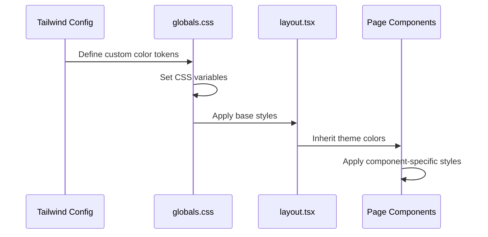

# Design Document: Dark Fintech Theme

## Overview

This design implements a professional dark fintech color palette across the entire Next.js application. The theme uses a dark slate background (#0F172A) with carefully selected accent colors to create a modern, professional fintech aesthetic. The implementation leverages Tailwind CSS custom colors and CSS variables to ensure consistency across all pages (landing, apply, results, admin) while maintaining existing functionality and layout integrity.

## Architecture

```mermaid
graph TD
    A[Tailwind Config] --> B[CSS Variables]
    B --> C[Global Styles]
    C --> D[Component Styles]
    D --> E[Landing Page]
    D --> F[Apply Page]
    D --> G[Results Page]
    D --> H[Admin Page]
    
    style A fill:#2563EB
    style B fill:#1E293B
    style C fill:#1E293B
    style D fill:#1E293B
    style E fill:#0F172A
    style F fill:#0F172A
    style G fill:#0F172A
    style H fill:#0F172A
```



## Main Workflow



## Components and Interfaces

### Theme Configuration Interface

```typescript
interface ThemeColors {
  background: string;        // #0F172A - Main background
  cardBackground: string;    // #1E293B - Card/surface background
  primaryButton: string;     // #2563EB - Primary action color
  primaryButtonHover: string; // #1D4ED8 - Button hover state
  accentText: string;        // #10B981 - Success/accent text
  mainText: string;          // #E2E8F0 - Primary text color
  mutedText: string;         // #94A3B8 - Secondary text color
}
```

### Color Token System

```typescript
interface ColorTokens {
  // Background colors
  'bg-fintech-dark': '#0F172A';
  'bg-fintech-card': '#1E293B';
  
  // Button colors
  'btn-primary': '#2563EB';
  'btn-primary-hover': '#1D4ED8';
  
  // Text colors
  'text-accent': '#10B981';
  'text-main': '#E2E8F0';
  'text-muted': '#94A3B8';
}
```

## Data Models

### Tailwind Configuration Extension

```typescript
interface TailwindThemeExtension {
  colors: {
    'fintech-dark': string;
    'fintech-card': string;
    'fintech-primary': string;
    'fintech-primary-hover': string;
    'fintech-accent': string;
    'fintech-text': string;
    'fintech-muted': string;
  };
}
```

## Key Functions with Formal Specifications

### Function 1: updateTailwindConfig()

```typescript
function updateTailwindConfig(config: Config): Config
```

**Preconditions:**
- `config` is a valid Tailwind configuration object
- `config.theme` exists and is extensible

**Postconditions:**
- Returns updated config with fintech color tokens
- Original config structure is preserved
- All new colors are accessible via Tailwind classes

**Loop Invariants:** N/A

### Function 2: applyGlobalStyles()

```typescript
function applyGlobalStyles(): void
```

**Preconditions:**
- CSS variables can be set on `:root`
- globals.css is loaded before component styles

**Postconditions:**
- All CSS variables are defined and accessible
- Background and text colors are applied to body
- No existing styles are broken

**Loop Invariants:** N/A

### Function 3: updateComponentStyles()

```typescript
function updateComponentStyles(component: ReactElement): ReactElement
```

**Preconditions:**
- Component uses Tailwind classes or CSS variables
- Component structure is valid React element

**Postconditions:**
- Component uses new fintech color classes
- Layout and functionality remain unchanged
- Accessibility is maintained

**Loop Invariants:** N/A

## Algorithmic Pseudocode

### Main Theme Application Algorithm

```pascal
ALGORITHM applyFintechTheme()
INPUT: None
OUTPUT: Themed application

BEGIN
  // Step 1: Update Tailwind configuration
  tailwindConfig ← loadTailwindConfig()
  tailwindConfig.theme.extend.colors ← {
    'fintech-dark': '#0F172A',
    'fintech-card': '#1E293B',
    'fintech-primary': '#2563EB',
    'fintech-primary-hover': '#1D4ED8',
    'fintech-accent': '#10B981',
    'fintech-text': '#E2E8F0',
    'fintech-muted': '#94A3B8'
  }
  saveTailwindConfig(tailwindConfig)
  
  // Step 2: Update CSS variables
  cssVariables ← {
    '--background': '#0F172A',
    '--card-background': '#1E293B',
    '--primary-button': '#2563EB',
    '--primary-button-hover': '#1D4ED8',
    '--accent-text': '#10B981',
    '--main-text': '#E2E8F0',
    '--muted-text': '#94A3B8'
  }
  applyToRoot(cssVariables)
  
  // Step 3: Update component styles
  FOR each page IN [landing, apply, results, admin] DO
    components ← getPageComponents(page)
    FOR each component IN components DO
      updateBackgroundColors(component)
      updateTextColors(component)
      updateButtonColors(component)
      verifyAccessibility(component)
    END FOR
  END FOR
  
  ASSERT allPagesUseNewTheme()
  ASSERT noLayoutBreaks()
  
  RETURN themedApplication
END
```

**Preconditions:**
- Application uses Tailwind CSS
- All pages are accessible and modifiable
- No conflicting color definitions exist

**Postconditions:**
- All pages use the new fintech color palette
- No functionality is broken
- Layout integrity is maintained
- Accessibility standards are met

**Loop Invariants:**
- All processed components maintain their original functionality
- Color consistency is maintained across all processed pages

### Color Replacement Algorithm

```pascal
ALGORITHM replaceColors(component)
INPUT: component of type ReactElement
OUTPUT: updatedComponent with new colors

BEGIN
  // Map old colors to new fintech colors
  colorMap ← {
    'bg-slate-900': 'bg-fintech-dark',
    'bg-slate-800': 'bg-fintech-card',
    'bg-blue-600': 'bg-fintech-primary',
    'hover:bg-blue-700': 'hover:bg-fintech-primary-hover',
    'text-emerald-400': 'text-fintech-accent',
    'text-slate-50': 'text-fintech-text',
    'text-slate-300': 'text-fintech-muted'
  }
  
  // Replace class names
  FOR each className IN component.classList DO
    IF className IN colorMap.keys THEN
      component.classList.replace(className, colorMap[className])
    END IF
  END FOR
  
  // Verify no visual regression
  ASSERT component.layout = originalLayout
  ASSERT component.functionality = originalFunctionality
  
  RETURN component
END
```

**Preconditions:**
- Component has valid classList
- colorMap contains all necessary mappings

**Postconditions:**
- All color classes are updated to fintech theme
- Component structure is unchanged
- No classes are lost or duplicated

**Loop Invariants:**
- All previously processed classes remain correctly mapped
- Component classList remains valid throughout iteration

## Example Usage

### Tailwind Configuration

```typescript
// tailwind.config.ts
import type { Config } from "tailwindcss";

const config: Config = {
  content: [
    "./pages/**/*.{js,ts,jsx,tsx,mdx}",
    "./components/**/*.{js,ts,jsx,tsx,mdx}",
    "./app/**/*.{js,ts,jsx,tsx,mdx}",
  ],
  theme: {
    extend: {
      colors: {
        'fintech-dark': '#0F172A',
        'fintech-card': '#1E293B',
        'fintech-primary': '#2563EB',
        'fintech-primary-hover': '#1D4ED8',
        'fintech-accent': '#10B981',
        'fintech-text': '#E2E8F0',
        'fintech-muted': '#94A3B8',
      },
    },
  },
  plugins: [],
};
```

### CSS Variables

```css
/* globals.css */
:root {
  --background: #0F172A;
  --card-background: #1E293B;
  --primary-button: #2563EB;
  --primary-button-hover: #1D4ED8;
  --accent-text: #10B981;
  --main-text: #E2E8F0;
  --muted-text: #94A3B8;
}

body {
  background-color: var(--background);
  color: var(--main-text);
}
```

### Component Usage

```typescript
// Button component example
<button className="bg-fintech-primary hover:bg-fintech-primary-hover text-white">
  Submit Application
</button>

// Card component example
<div className="bg-fintech-card text-fintech-text">
  <h3 className="text-fintech-text">Card Title</h3>
  <p className="text-fintech-muted">Card description</p>
</div>

// Accent text example
<span className="text-fintech-accent">Success message</span>
```

## Correctness Properties

### Property 1: Color Consistency
```typescript
// All pages must use colors from the fintech palette
∀ page ∈ [landing, apply, results, admin]:
  ∀ element ∈ page.elements:
    element.backgroundColor ∈ FintechColorPalette ∨
    element.backgroundColor = 'transparent'
```

### Property 2: Layout Preservation
```typescript
// Layout must remain unchanged after theme application
∀ component ∈ Application.components:
  component.layout_before = component.layout_after
```

### Property 3: Functionality Preservation
```typescript
// All interactive elements must maintain functionality
∀ button ∈ Application.buttons:
  button.onClick_before = button.onClick_after ∧
  button.isAccessible = true
```

### Property 4: Accessibility Compliance
```typescript
// Color contrast must meet WCAG AA standards
∀ textElement ∈ Application.textElements:
  contrastRatio(textElement.color, textElement.backgroundColor) ≥ 4.5
```

### Property 5: CSS Variable Availability
```typescript
// All CSS variables must be defined and accessible
∀ variable ∈ RequiredCSSVariables:
  isDefined(variable) ∧ isAccessible(variable)
```

## Error Handling

### Error Scenario 1: Missing Color Definition

**Condition**: A component references a color that doesn't exist in the palette
**Response**: Fall back to closest semantic color from palette
**Recovery**: Log warning and use default fintech-dark or fintech-text

### Error Scenario 2: Contrast Ratio Failure

**Condition**: Text color doesn't meet WCAG contrast requirements against background
**Response**: Automatically adjust text color to meet minimum contrast ratio
**Recovery**: Use fintech-text (#E2E8F0) for dark backgrounds, ensure 4.5:1 ratio

### Error Scenario 3: Layout Break

**Condition**: Color change causes unexpected layout shift
**Response**: Revert to previous color and log error
**Recovery**: Investigate component-specific styling conflicts

## Testing Strategy

### Unit Testing Approach

Test individual color applications:
- Verify Tailwind config extends correctly
- Test CSS variable definitions
- Validate color utility class generation
- Check component color prop updates

### Integration Testing Approach

Test theme application across pages:
- Verify all pages render with new colors
- Test navigation between themed pages
- Validate form submissions work with new styles
- Check admin dashboard data display

### Visual Regression Testing

- Capture screenshots of all pages before/after
- Compare layouts to ensure no shifts
- Verify button sizes and spacing unchanged
- Check responsive behavior on mobile/tablet/desktop

## Performance Considerations

- CSS variables provide O(1) lookup time
- Tailwind purges unused color classes in production
- No runtime color calculations required
- Theme changes don't trigger unnecessary re-renders

## Security Considerations

- No user input affects color values
- CSS injection prevented by Tailwind's class-based approach
- No external color resources loaded
- All colors defined statically in configuration

## Dependencies

- Tailwind CSS v3.x
- Next.js 14+
- React 18+
- PostCSS for CSS processing
- No additional color manipulation libraries required
